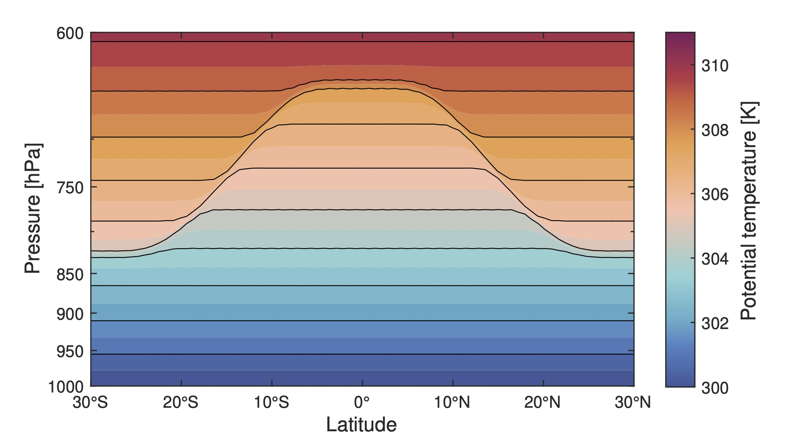
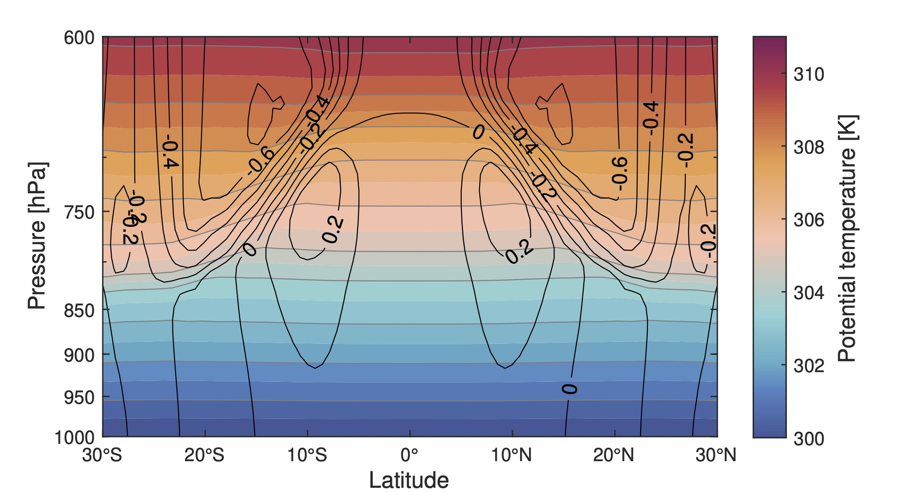
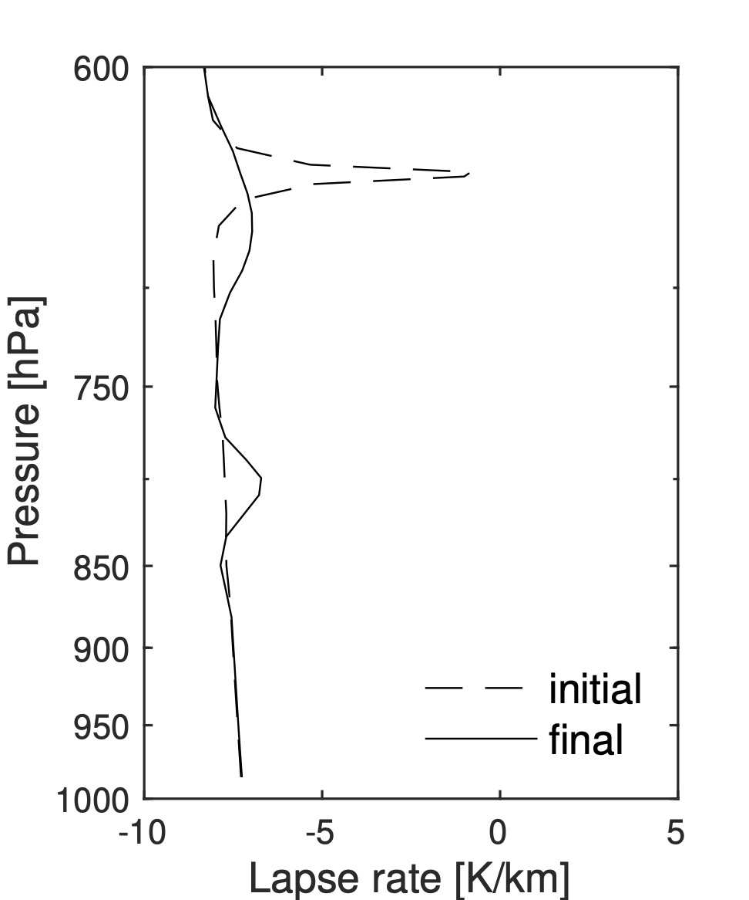
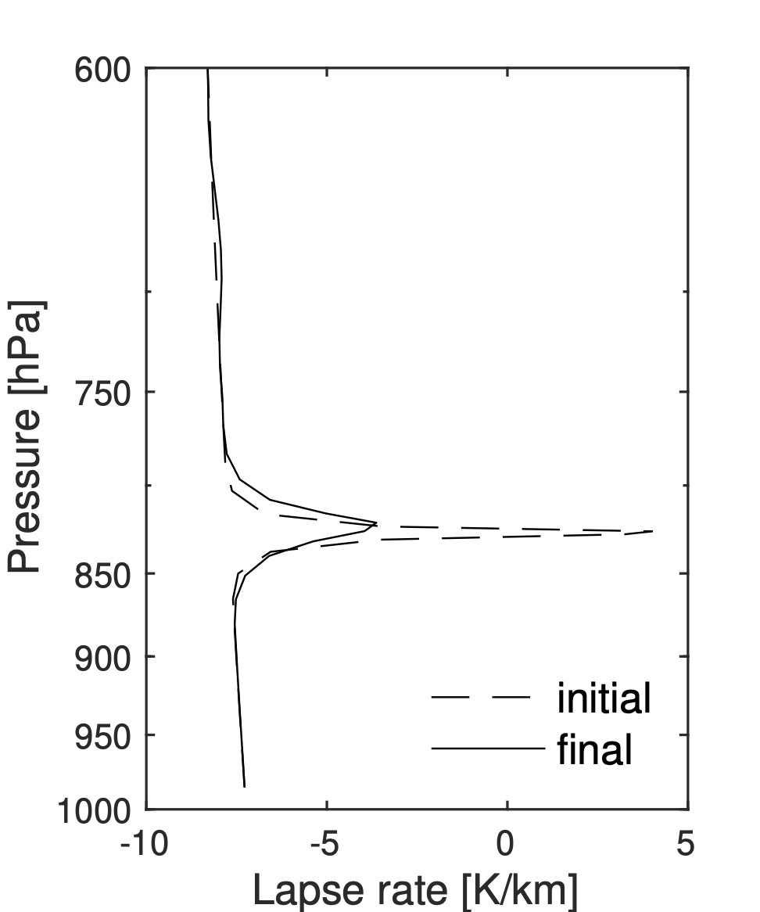

# trade-cumulus-inversion
This project aims to replicate and extend the experiments on the dynamical adjustment problem presented by [Shubert et al. (1995)](https://doi.org/10.1175/1520-0469(1995)052<2941:DAOTTW>2.0.CO;2). 
The study focused on investigating the impact of dynamical adjustment on the inversion height in the tropical and subtropical regions.
We are working to recreate the experiments and conduct further experiments to explore the problem based on the dynamical model.

We revisit the original Fortran77 code that was used for the experiments 1 and 2 in the study, which can be found [here](https://nam02.safelinks.protection.outlook.com/?url=http%3A%2F%2Fjohnson.atmos.colostate.edu%2Fpublic%2Fpaulc%2Ftrade_inv_model%2F&amp;data=05%7C01%7Calex.gonzalez%40whoi.edu%7C4f01efc146594345034708da6b69088a%7Cd44c5cc6d18c46cc8abd4fdf5b6e5944%7C0%7C0%7C637940396117496548%7CUnknown%7CTWFpbGZsb3d8eyJWIjoiMC4wLjAwMDAiLCJQIjoiV2luMzIiLCJBTiI6Ik1haWwiLCJXVCI6Mn0%3D%7C3000%7C%7C%7C&amp;sdata=cXL1GsYWX4qhV%2BpGYW483vW5O0Wr22eouqZONjN2lgo%3D&amp;reserved=0)
Our objective is to create a modern and accessible re-implementation, making it easier for researchers to explore the dynamical adjustment problem and its application to other meteorological problems.

## Experiments
* *Adjustment of a sloping trade inversion layer*: The MATLAB implementation of Experiment 2 from the original study can be executed using the invtci.m script as the main program.
    Executing `plotFinalField_exp2.m` will generate the final field of the experiment, corresponding to Figs. 11 & 12 in the 1995 text.
* *Dynamical extension of subtropical inversions into the tropics*: Experiment 1 differs from the second primarily by a different initial condition. We are currently working on implementing this experiment.

## Language
The author has extensive experience with MATLAB, making it the first choice for the modern implementation of the experiments. 

However, we have also translated parts of the codes into Python.
The following Jupyter Notebook `invtci.ipynb` are currently being worked on and will soon be available for experimentation.
However, we cannot guarantee the performance of these Python scripts. 

## Feedback and notes
If you have any problem or suggestion for the re-implementation, please feel free to contact [William En-Chi Lee](mailto:williameclee@gmail.com).

This document was last updated on August 6th, 2023.